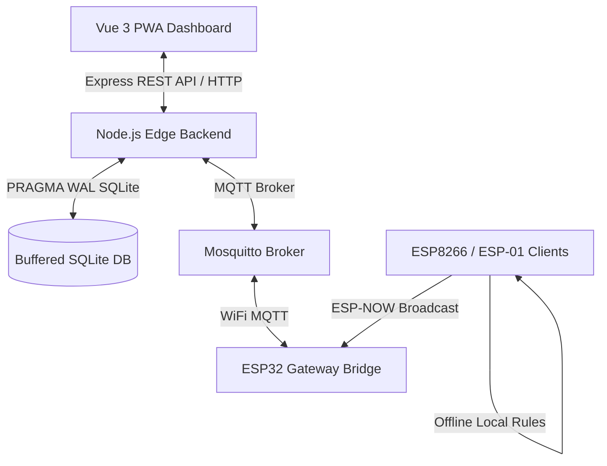

# IoT Edge OS (Omega OS)

Omega OS is a robust, modular, and fully local IoT Operating System (Blynk/Sinric Pro alternative) designed for edge-computing networks. It runs on lightweight Debian home servers inside Docker and deploys dynamic configuration matrices to ESP32, ESP8266, and ESP-01/S microcontrollers.

---

## 🚀 Key Architectural Layers



### 1. High-Performance Telemetry RAM Buffer
- Uses SQLite configured under `PRAGMA journal_mode = WAL` and `PRAGMA synchronous = NORMAL`.
- Implements a transaction queue that buffers telemetry logs in RAM, committing them in batches (every 5 mins or 1000 logs) to protect server SSDs from wear.
- Implements sequential Mutex locks preventing database write collisions.
- Integrates graceful `SIGTERM` signal trapping to flush active buffers upon container restarts.

### 2. Hybrid Rules & Astronomy Engine
- **Local Rules:** Rules linking pins on the same MAC address compile to compressed JSON (`/rules.json`) pushed to device LittleFS, running offline without server interaction.
- **Global Rules:** Cross-device rules execute on the server via MQTT logic.
- **Astronomy Scheduler:** Standalone NOAA solar calculations evaluate sunrise/sunset times for Istanbul (`41.0082° N, 28.9784° E`, UTC+3) for scheduled automation triggers.
- **JS Sandbox:** Custom logic nodes run in a secure `vm` container with a strict 100ms CPU execution limit.

### 3. Captured WiFi Portal & ESP-NOW Failover
- Microcontrollers boot into a captive configuration portal (`192.168.4.1` on AP `ESP_Kurulum_AP`) with DNS redirection if WiFi credentials are unset.
- If WiFi connection fails after 3 retries (10s intervals), the device locks the WiFi channel and falls back to ESP-NOW broadcast mode.
- ESP32 Gateway captures ESP-NOW signals and bridges them to the local Mosquitto MQTT Broker.

### 4. Dynamic Hardware Pin Manager
- Reads `/pins.json` from LittleFS to setup and modify pins at runtime.
- Supports:
  - **DI / DO:** Digital outputs and debounced inputs (50ms filter).
  - **AI / PWM:** Analog input with a deadband change filter (> 5) and duty-cycle control.
  - **Sensors:** Custom bit-banged DHT22 reader and Dallas OneWire DS18B20.
  - **Actuators:** LEDC-based Servo control (ESP32) and AccelStepper step motor loops.
- **Safety Locks:** Automatic `Serial.end()` locks if ESP-01/S maps RX/TX pins to prevent terminal debug noise.

---

## 🛠️ Docker Deployment

### 1. Requirements
- Docker & Docker Compose
- Debian 13 / CasaOS (or any Linux machine)

### 2. Startup
Clone the repository and run:
```bash
docker compose up -d
```
This launches:
- **MQTT Broker**: Ports `1883` (MQTT)
- **Backend Service + Web UI**: Ports `3000` (Web Console / REST API)

---

## 💻 Web Dashboard Console
The dashboard is built on **Vue 3, Vite, Tailwind CSS v4, Vue-Flow, and Vite PWA**. It is hosted directly on port `3000`.

- **Dashboard**: Real-time status cards showing online status and widget sliders/dials.
- **Pin Config**: Interface to add, modify, or delete hardware pins, enforcing strapping pin warnings.
- **Rules Designer**: Flowchart editor linking device inputs and schedules to logic conditions and outputs.
- **Telemetry Explorer**: হাম log database query panel.

---

## 📡 API & MQTT Schema

### REST Endpoints
- `GET /api/devices`: Returns registered devices hydrated with the latest pin states.
- `POST /api/config/:mac`: Uploads pin configurations array to microcontroller.
- `GET /api/telemetry`: Queries database logs.
- `POST /api/flow`: Compiles Vue-Flow diagram.

### MQTT Hierarchy
- `cihaz/kayit/[MAC]`: Device online notification.
- `cihaz/durum/[MAC]`: LWT offline status.
- `cihaz/rapor/[MAC]`: Raw JSON telemetry payload (`{"GPIO_5": "1"}`).
- `cihaz/config/[MAC]`: Pushes compiled pins or offline local rules.
- `cihaz/kontrol/[MAC]/[PIN]`: Direct write command (`"1"` / `"0"` / `"180"`).

---

## 🔌 Microcontroller Configuration
Upload files located in `/firmware` directory using Arduino IDE:
1. Select target board (`ESP32 Dev Module` or `Generic ESP8266 Module`).
2. Install dependencies: `PubSubClient`, `ArduinoJson`, `OneWire`, `DallasTemperature`, `AccelStepper`.
3. Build and upload sketch. Upload data files `/pins.json` and `/rules.json` to LittleFS.
